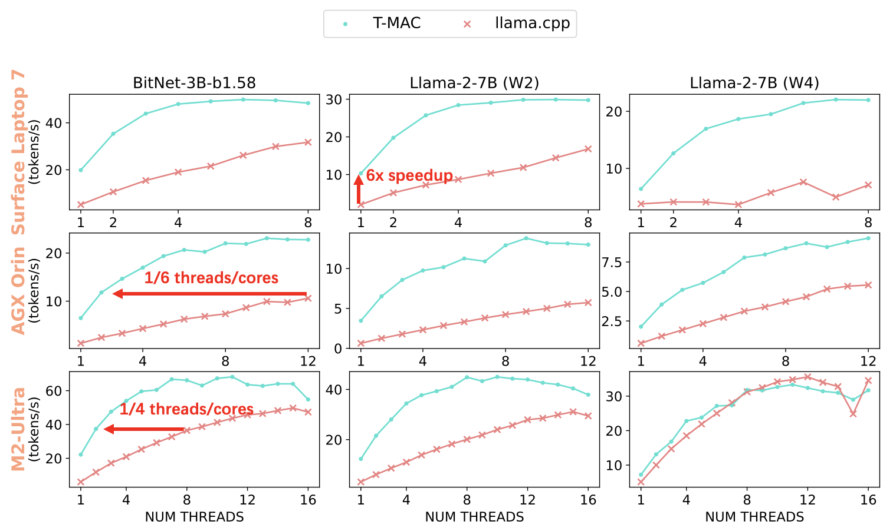
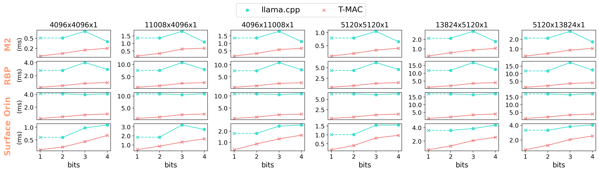
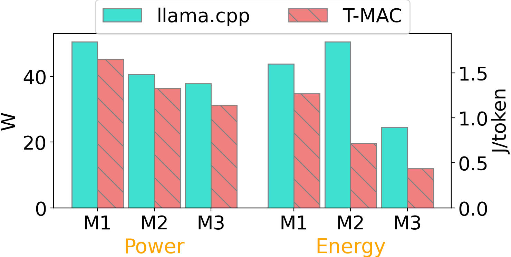

# T-MAC

<h3 align="center">
    
    <p><a href=https://huggingface.co/1bitLLM/bitnet_b1_58-3B>BitNet</a> on T-MAC (LUT-based) vs llama.cpp (dequantization-based)</p>
</h3>

## News

- 08/06/2024 🚀: Support 1/2/3/4-bit quantized Llama models in GPTQ format. Test it using the pretrained models released by [EfficientQAT](https://github.com/OpenGVLab/EfficientQAT).

- 07/27/2024 ✨: We've noted that T-MAC is even faster than the NPU in token generation speed on the latest Snapdragon X Elite chipset! Check [Compared to NPU](#compared-to-npu) for more details.

- 07/23/2024 🚀🚀: We've enabled the execution of any 2-bit quantized Llama model in GPTQ format via T-MAC! Test it using the pretrained models released by [EfficientQAT](https://github.com/OpenGVLab/EfficientQAT).

- 07/22/2024 🚀🚀: We've added native deployment support for Windows on ARM. T-MAC demonstrates a substantial 5x speedup on the Surface Laptop 7.

## Introduction

T-MAC is a kernel library to directly support mixed-precision matrix multiplication (int1/2/3/4 x int8/fp16/fp32) without the need for dequantization by utilizing lookup tables. T-MAC aims to boost low-bit LLM inference on CPUs. T-MAC already offers support for various low-bit models, including W4A16 from GPTQ/gguf, W2A16 from [BitDistiller](https://github.com/DD-DuDa/BitDistiller)/[EfficientQAT](https://github.com/OpenGVLab/EfficientQAT) and W1(.58)A8 from [BitNet](https://huggingface.co/1bitLLM/bitnet_b1_58-3B) on OSX/Linux/Windows equipped with ARM/Intel CPUs.

T-MAC achieves a token generation throughput of 20 tokens/sec with a single core and 48 tokens/sec with four cores on Surface Laptop 7 for 3B BitNet, which is a 4~5x speedup compared to SOTA CPU low-bit framework ([llama.cpp](https://github.com/ggerganov/llama.cpp)). T-MAC can even reach 11 tokens/sec on lower-end devices like Raspberry Pi 5.

## End-2-End Speedup

We evaluate the token generation performance of different models on five different devices: Surface Laptop 7, Apple M2-Ultra, Jetson AGX Orin, Raspberry Pi 5 and Surface Book 3. Check [datasheet](docs/profiling_data.md) for more details.

> We evaluate BitNet-3B and Llama-2-7B (W2) with T-MAC 2-bit and llama.cpp Q2_K, and evaluate Llama-2-7B (W4) with T-MAC 4-bit and llama.cpp Q4_0.

In addition to providing a significant speedup, T-MAC can also match the same performance using fewer CPU cores. For instance, to reach 40 tokens/sec, a throughput that greatly surpasses human reading speed, T-MAC only requires 2 cores, while llama.cpp requires 8 cores. On Jetson AGX Orin, to achieve 10 tokens/sec, a throughput that already meets human reading speed, T-MAC only requires 2 cores, while llama.cpp uses all 12 cores. T-MAC can meet real-time requirements on less powerful devices equipped with fewer CPU cores like Raspberry Pi 5. By using fewer cores, T-MAC can reserve computational resources for other applications and significantly reduce power and energy consumption, both of which are crucial for edge devices.

<h3 align="center">
    
    <p>T-MAC achieves significant speedup at single-threads and consumes much less CPU cores to reach the same throughput</p>
</h3>

> The throughputs of T-MAC are obtained without fast-aggregation. Users can toggle on fast-aggregation through `-fa` to achieve an additional speedup of 10%~20%.

## Kernel-level Speedup

Our GEMM kernels demonstrate superior performance over SOTA low-bit GEMM on CPU. The following figure shows the speedup compared to llama.cpp for llama-7b kernels during token generation (NUM_THREADS=1):



> llama.cpp doesn't provide 1-bit kernel implementation, but we can deduce it from the 2-bit, as it won't bring additional speedup according to the 2/3/4-bit results.

Although we haven't integrated multi-batch (N>1) GEMM into llama.cpp, T-MAC can achieve significant speedup due to reduced computaional cost, which ensures superior performance on prompt evaluation and multi-batch token generation. The following figures shows the speedup compared to llama.cpp using OpenBLAS backend (NUM_THREADS=1):


> M2-Ultra is an exception as it is equipped with a specially designed [AMX coprocessor](https://github.com/corsix/amx) to accelerate multi-batch GEMM. However, T-MAC can still achieve comparable performance at 2-bit.

## Energy and Power Saving

By replacing heavy fused-multiply-add instructions with table lookup instructions, T-MAC significantly reduces power consumption. Combined with the speedup, T-MAC ultimately results in a substantial decrease in total energy consumption.

<p align="center">
    
    <p align="center">Multi-threading power/energy consumption on M2-Ultra for three models, M1: Llama-2-7B (W4), M2: Llama-2-7B (W2) and M3: BitNet-3B</p>
</p>

> Data sampled with [powermetrics](https://www.unix.com/man-page/osx/1/powermetrics/).

### Compared to NPU

On the latest Snapdragon X Elite chipset, CPU through T-MAC achieves better performance compared to NPU through Qualcomm Snapdragon Neural Processing Engine (NPE).

When deploying the llama-2-7b-4bit model on it, the NPU can only generate 10.4 tokens/sec (according to the data released [here](https://aihub.qualcomm.com/models/llama_v2_7b_chat_quantized)), while the CPU using T-MAC can reach 12.6 tokens/sec with two cores, and even up to 22 tokens/sec. Considering that T-MAC's computing performance can linearly improve with the number of bits decreases (which is not observable on GPUs and NPUs based on dequantization), T-MAC can even match the NPU with a single-core CPU at 2 bits.

| Framework       | Model           | NUM_THREADS | Throughput (tokens/sec) |
|-----------------|-----------------|-------------|:------------------------|
| T-MAC (CPU)     | llama-2-7b (W4) |      2      |         <b>12.6</b>     |
| T-MAC (CPU)     | llama-2-7b (W4) |      4      |         <b>18.7</b>     |
| T-MAC (CPU)     | llama-2-7b (W2) |      1      |          9.3            |
| T-MAC (CPU)     | llama-2-7b (W2) |      4      |         <b>28.4</b>     |
|                 |                 |             |                         |
| NPE (NPU)       | llama-2-7b (W4) |      -      |          10.4           |

> For fair comparison, we have aligned our settings with those of the NPU, including a input length of 1024 and an output length of 1024. Although Qualcomms deploy a model of 3.6GB, we deploy a slightly larger model of 3.7GB, due to our token-embed remaining un-quantized.

### Compared to CUDA GPU

T-MAC achieves comparable 2-bit mpGEMM performance compared to CUDA GPU on Jetson AGX Orin. While the CUDA GPU outperforms the CPU in executing kernels other than mpGEMM, making the end-to-end performance of T-MAC (CPU) slightly slower, T-MAC can deliver considerable savings in power and energy consumption.

| Framework       | Throughput (tokens/sec) | Power (W)   | Energy (J/token) |
|-----------------|:------------------------|:------------|:-----------------|
| llama.cpp (CPU) |         7.08            |     15.0    | 2.12             |
| llama.cpp (GPU) |        <b>20.03</b>     |     30.8    | 1.54             |
| T-MAC (CPU)     |         15.62           | <b>10.4</b> | <b>0.66</b>      |

<p align="center">
<b>Throughput/power/energy comparison for Llama-2-7B (W2) on NVIDIA Jetson AGX Orin (NUM_THREADS=12 for CPU)</b>
</p>

> Data sampled with [jetson-stats](https://github.com/rbonghi/jetson_stats) under power mode MAXN.

## Installation

### Requirements

- Python (3.8 recommended)
- virtualenv
- cmake>=3.22

### OSX (Apple Silicon)

First, install `cmake`, `zstd` (dependency of llvm) and `libomp` (dependency of tvm). Homebrew is recommended:

```bash
brew install cmake zlib libomp
```

> If `zstd` is installed through homebrew, than `cmake` should also be installed through homebrew to ensure that `zstd` can be found by `cmake`.

Install `t_mac` from the source (please run in a `virtualenv`):

```bash
git clone --recursive https://github.com/microsoft/T-MAC.git
# in virtualenv
pip install . -v  # or pip install -e . -v
source build/t-mac-envs.sh
```

The command will download clang+llvm and build tvm from source. So it might take a bit of time.

### Ubuntu (aarch64/x86_64)

Install cmake>=3.22 from [Official Page](https://cmake.org/download/).

Then install TVM build dependencies:

```bash
sudo apt install build-essential libtinfo-dev zlib1g-dev libzstd-dev libxml2-dev
```

Install `t_mac` from the source (please run in a `virtualenv`):

```bash
git clone --recursive https://github.com/microsoft/T-MAC.git
# in virtualenv
pip install . -v  # or pip install -e . -v
source build/t-mac-envs.sh
```

The command will download clang+llvm and build tvm from source. So it might take a bit of time.

### Windows (x86_64)

Due to lack of stable clang+llvm prebuilt on Windows, Conda + Visual Studio is recommended to install dependencies.

First, install Visual Studio 2019 and toggle on `Desk development with C++` and `C++ Clang tools for Windows`. Then, create conda environment within `Developer PowerShell for VS 2019`:

```powershell
git clone --recursive https://github.com/microsoft/T-MAC.git
cd T-MAC
conda env create --file conda\tvm-build-environment.yaml
conda activate tvm-build
```

> If you are using Visual Studio 2022, replace `llvmdev =14.0.6` with `llvmdev =17.0.6` in the yaml file.

After that, build TVM with:

```powershell
cd 3rdparty\tvm
mkdir build
cp cmake\config.cmake build
```

Append `set(USE_LLVM llvm-config)` to `build\config.cmake`.

```powershell
cd build
cmake .. -A x64
cmake --build . --config Release -- /m
```

Install `t_mac` from the source:

```powershell
cd ..\..\..\  # back to project root directory
$env:MANUAL_BUILD = "1"
$env:PYTHONPATH = "$pwd\3rdparty\tvm\python"
pip install . -v  # or pip install -e . -v
```

### Windows (ARM64)

> The following process could be more complicated. However, if your deployment scenerio doesn't require a native build, you can use WSL/docker and follow the Ubuntu guide.

First, install Visual Studio 2022(/2019) and toggle on `Desk development with C++`. Then, create conda environment within `Developer PowerShell for VS 20XX`.

```powershell
git clone --recursive https://github.com/microsoft/T-MAC.git
cd T-MAC
conda env create --file conda\tvm-build-environment.yaml
conda activate tvm-build
```

Remember to replace `llvmdev =14.0.6` with `llvmdev =17.0.6` in the yaml file if you are using Visual Studio 2022 (which is recommended on ARM64 for better performance).

After that, build TVM with:

```powershell
cd 3rdparty\tvm
mkdir build
cp cmake\config.cmake build
```

Append `set(USE_LLVM llvm-config)` to `build\config.cmake`.

```powershell
cd build
cmake .. -A x64  # Build TVM in x64, as Python and dependencies are x64
cmake --build . --config Release -- /m
```

> If you encounter errors like `string sub-command regex, mode replace: regex "$" matched an empty string.` during running `cmake .. -A x64` while building TVM, don't worry, and just run `cmake .. -A x64` again. Check [this issue of LLVM](https://github.com/llvm/llvm-project/issues/83802) for more details.

As clang tools in Visual Studio are in fact emulated x64 tools, we recommend to install the native arm64 tools manually.

- Install CMake from [Offical Windows ARM installer](https://github.com/Kitware/CMake/releases/download/v3.30.1/cmake-3.30.1-windows-arm64.msi).
- Download Ninja from [Release Page](https://github.com/ninja-build/ninja/releases/download/v1.12.1/ninja-winarm64.zip) and add to Path.
- Install Clang from [Release Page](https://github.com/llvm/llvm-project/releases/download/llvmorg-17.0.6/LLVM-17.0.6-woa64.exe).

Please note:

- The conda environment **should only be used while building TVM**. `conda deactivate tvm-build` after building TVM.

Starting the following commands in virtualenv and **outside of Developer Command Prompt/Powershell for VS** to ensure our native clang tools are used.

Install `t_mac` from the source:

```powershell
cd ..\..\..\  # back to project root directory
$env:MANUAL_BUILD = "1"
$env:PYTHONPATH = "$pwd\3rdparty\tvm\python"
# In virtualenv
pip install wmi  # To detect the native ARM64 CPU within x86_64 python
pip install . -v  # or pip install -e . -v
```

### Verification

After that, you can verify the installation through: `python -c "import t_mac; print(t_mac.__version__); from tvm.contrib.clang import find_clang; print(find_clang())"`.

## Usage

Currently, we supports end-to-end inference through llama.cpp integration.

We have provided an **all-in-one script**. Invoke it with:

```bash
pip install 3rdparty/llama.cpp/gguf-py
huggingface-cli download 1bitLLM/bitnet_b1_58-3B --local-dir ${model_dir}
python tools/run_pipeline.py -o ${model_dir}
```

We have also supported models in GTPQ format from [GPTQModel](https://github.com/ModelCloud/GPTQModel)/[EfficientQAT](https://github.com/OpenGVLab/EfficientQAT). Try it out with officially released EfficientQAT (of GPTQ format) [Llama-3-8b-instruct-w2-g128](https://huggingface.co/ChenMnZ/Llama-3-8b-instruct-EfficientQAT-w2g128-GPTQ):

```bash
huggingface-cli download ChenMnZ/Llama-3-8b-instruct-EfficientQAT-w2g128-GPTQ --local-dir ${model_dir}
python tools/run_pipeline.py -o ${model_dir} -m llama-3-8b-2bit
```

> Use `-p` or `-s` argument to select the steps you want to run. And use `-u` argument to use our prebuilt kernels for ARM.

> Use `--zero_point` for asymmetric quantization, which is required for *most* EfficientQAT models (only verified with Llama-3-8b-instruct-w4-g128/Llama-3-8b-instruct-w2-g128).

An example output:

```
Running STEP.0: Compile kernels
  Running command in /Users/user/jianyu/T-MAC/deploy:
    python compile.py -o tuned -da -nt 4 -tb -gc -gs 128 -ags 64 -t -m hf-bitnet-3b -r
Running STEP.1: Build T-MAC C++ CMakeFiles
  Running command in /Users/user/jianyu/T-MAC/build:
    cmake -DCMAKE_INSTALL_PREFIX=/Users/user/jianyu/T-MAC/install ..
Running STEP.2: Install T-MAC C++
  Running command in /Users/user/jianyu/T-MAC/build:
    cmake --build . --target install --config Release
Running STEP.3: Convert HF to GGUF
  Running command in /Users/user/jianyu/T-MAC/3rdparty/llama.cpp:
    python convert-hf-to-gguf-t-mac.py /Users/user/Downloads/test_models/hf-bitnet-3B --outtype i2 --outfile /Users/user/Downloads/test_models/hf-bitnet-3B/ggml-model.i2.gguf --kcfg /Users/user/jianyu/T-MAC/install/lib/kcfg.ini
Running STEP.4: Build llama.cpp CMakeFiles
  Running command in /Users/user/jianyu/T-MAC/3rdparty/llama.cpp/build:
    cmake .. -DLLAMA_TMAC=ON -DCMAKE_PREFIX_PATH=/Users/user/jianyu/T-MAC/install/lib/cmake/t-mac -DCMAKE_BUILD_TYPE=Release -DLLAMA_LLAMAFILE_DEFAULT=OFF -DCMAKE_C_COMPILER=clang -DCMAKE_CXX_COMPILER=clang++
Running STEP.5: Build llama.cpp
  Running command in /Users/user/jianyu/T-MAC/3rdparty/llama.cpp/build:
    cmake --build . --target main --config Release
Running STEP.6: Run inference
  Running command in /Users/user/jianyu/T-MAC/3rdparty/llama.cpp/build:
    /Users/user/jianyu/T-MAC/3rdparty/llama.cpp/build/bin/main -m /Users/user/Downloads/test_models/hf-bitnet-3B/ggml-model.i2.gguf -n 128 -t 4 -p Microsoft Corporation is an American multinational corporation and technology company headquartered in Redmond, Washington. -b 1 -ngl 0 -c 2048
Check logs/2024-07-15-17-10-11.log for inference output
```

## Upcoming Features

We will soon:

- [x] Add `I4` format to simplify the deployment of 4-bit models.
- [ ] Embed T-MAC GEMM kernels into llama.cpp to accelerate prefill/prompt.
- [ ] Optimize for ARMv9 CPU with SME2 through LUTI4

## Techniques

LLM inference incurs significant computational cost. Low-bit quantization, a widely adopted technique, introduces the challenge of mixed-precision GEMM (mpGEMM), which is not directly supported by hardware and requires convert/dequant operations.

We propose the use of a lookup table (LUT) to support mpGEMM. Our method involves the following key technniques:

1. Given the low precision of weights, we group one-bit weights (e.g., into groups of 4), precompute all possible partial sums, and then use a LUT to store them.
2. We employ shift and accumulate operations to support scalable bits from 1 to 4.
3. On a CPU, we utilize tbl/pshuf instructions for fast table lookup.
4. We reduce the table size from $2^n$ to $2^{n-1}$, incorporating a sign bit to accelerate LUT precomputation.

Our method exhibits several notable characteristics:

1. T-MAC shows a linear scaling ratio of FLOPs and inference latency relative to the number of bits. This contrasts with traditional convert-based methods, which fail to achieve additional speedup when reducing from 4 bits to lower bits.
2. T-MAC inherently supports bit-wise computation for int1/2/3/4, eliminating the need for dequantization. Furthermore, it accommodates all types of activations (e.g., fp8, fp16, int8) using fast table lookup and add instructions, bypassing the need for poorly supported fused-multiply-add instructions.
3. T-MAC holds the potential to realize performance gains across all processing units (PUs).

## Cite
If you find this repository useful, please use the following BibTeX entry for citation.
```
@misc{wei2024tmaccpurenaissancetable,
      title={T-MAC: CPU Renaissance via Table Lookup for Low-Bit LLM Deployment on Edge}, 
      author={Jianyu Wei and Shijie Cao and Ting Cao and Lingxiao Ma and Lei Wang and Yanyong Zhang and Mao Yang},
      year={2024},
      eprint={2407.00088},
      archivePrefix={arXiv},
      primaryClass={cs.DC},
      url={https://arxiv.org/abs/2407.00088}, 
}
```
