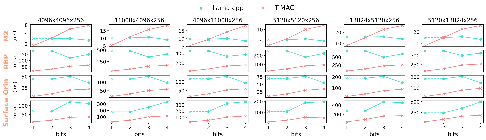

# T-MAC

## Introduction

T-MAC is a kernel library supporting mixed-precission GeMM on CPUs.

LLM inference incurs significant computational cost. Low-bit quantization, a widely adopted technique, introduces the challenge of mixed-precision GeMM (mpGeMM), which is not directly supported by hardware and requires convert/dequant operations.

We propose the use of a lookup table (LUT) to support mpGeMM. Our method involves the following key technniques:

1. Given the low precision of weights, we group one-bit weights (e.g., into groups of 4), precompute all possible partial sums, and then use a LUT to store them.
2. We employ shift and accumulate operations to support scalable bits from 1 to 4.
3. On a CPU, we utilize tbl/pshuf instructions for fast table lookup.
4. We reduce the table size from $2^n$ to $2^{n-1}$, incorporating a sign bit to accelerate LUT precomputation.

Our method exhibits several notable characteristics:

1. It shows a linear scaling ratio of FLOPs and inference latency relative to the number of bits. This contrasts with traditional convert-based methods, which fail to achieve additional speedup when reducing from 4 bits to lower bits.
2. T-MAC inherently supports bit-wise computation for int1/2/3/4, eliminating the need for dequantization. Furthermore, it accommodates all types of activations (e.g., fp8, fp16, int8) using fast table lookup and add instructions, bypassing the need for poorly supported fused-multiply-add instructions.
3. T-MAC holds the potential to realize performance gains across all processing units (PUs).

## Speedup to SOTA Low-Bit GeMM

Our kernels demonstrate superior performance over SOTA low-bit GeMM on CPU. Due to the linear scaling characteristic of T-MAC, our kernels deliver improved results at 2 bits, even surpassing the performance of Metal GPUs.

The following table shows the speedup on M2-Ultra compared to llama.cpp for llama-7b kernels during token generation (NUM_THREADS=16):

| Bits | M     | N | K     | T-MAC (CPU) (ms) | llama.cpp (CPU) | llama.cpp (METAL GPU) |
|------|-------|---|-------|-------------|-----------------|-------------------|
| 4    | 12288 | 1 | 4096  | 0.059  | 0.096         | 0.033           |
| 4    | 4096  | 1 | 4096  | 0.022 | 0.034         | 0.014            |
| 4    | 11008 | 1 | 4096  | 0.053 | 0.093         | 0.030           |
| 4    | 4096  | 1 | 11008 | 0.052 | 0.091         | 0.031           |
|      |       |   |       |             |                 |                   |
| 2    | 12288 | 1 | 4096  | 0.031 | 0.117          | 0.039           |
| 2    | 4096  | 1 | 4096  | 0.013   | 0.048          | 0.016           |
| 2    | 11008 | 1 | 4096  | 0.029 | 0.105         | 0.035           |
| 2    | 4096  | 1 | 11008 | 0.028    | 0.116         | 0.037           |



## E2E Speedup to llama.cpp

By integrating T-MAC kernels to llama.cpp, we obtain the following table to show the speedup on M2-Ultra for llama-7b duing token generation (NUM_THREADS=1):

| Model      | Bits | T-MAC (CPU) (tokens/sec) | llama.cpp (CPU) |
|------------|------|--------------------------|-----------------|
| llama-2-7b | 4    | 7.01                     | 5.56            |
| llama-2-7b | 2    | 16.17                    | 3.63            |
|            |      |                          |                 |
| BitNet-3b  | 2    | 24.36                    | 7.38            |

We also profile multi-threading performance for llama-2-7b and llama-2-70b:

| Model       | Bits | threads | T-MAC (CPU) (tokens/sec) | llama.cpp (CPU) |
|-------------|------|---------|--------------------------|-----------------|
| llama-2-7b  | 4 | 1 | 7.01  | 5.63  |
| llama-2-7b  | 4 | 2 | 13.16 | 10.23 |
| llama-2-7b  | 4 | 4 | 23.42 | 19.73 |
| llama-2-7b  | 4 | 8 | 35.12 | 31.75 |
|             |   |   |       |       |
| llama-2-70b | 2 | 1  | 1.39	| 0.35 |
| llama-2-70b | 2 | 8  | 5.78	| 2.39 |
| llama-2-70b | 2 | 16 | 9.07	| 4.21 |

## Cite
If you find this repository useful, please use the following BibTeX entry for citation.
```
@misc{t-mac,
      title={T-MAC: CPU Renaissance via Table Lookup for Low-Bit LLM Inference},
      author={Jianyu Wei and Shijie Cao and Ting Cao and Lei Wang and Lingxiao Ma},
      year={2024},
      url={https://github.com/microsoft/T-MAC/}
}
```

## Usage

We currently supports mainstream int4 quantization (e.g., GGUF, GPTQ) on ARM CPU (e.g., M1/M2 Mac, Snapdragon CPUs) and Intel CPU (with AVX2).

### Installation

Install this project from source with:

```
git clone --recursive https://github.com/microsoft/T-MAC.git
cd T-MAC
pip install -e .
```

### Integration into llama.cpp (exprimental)

Currently, we have integrated T-MAC into llama.cpp on windows/linux/osx.

> We have provided prebuilt kernels at `deploy/tuned/kernels.cc` for fast test. To tune kernels on your own device for maximum performance or generate kernels of different shapes, follow [this document](docs/codegen.md).

If you are using Intel CPUs, first replace prebuilt kernels:
```
cd deploy\tuned
copy avx2\* .\
```

Build T-MAC with:

```bash
mkdir build
cd build
cmake -DCMAKE_INSTALL_PREFIX=${TMAC_PROJECT_DIR}/install ..
cmake --build . --target install --config Release
```

Build llama.cpp with T-MAC:

```bash
cd ../3rdparty/llama.cpp
mkdir build
cd build
cmake .. -DLLAMA_TMAC=ON -DCMAKE_PREFIX_PATH=${TMAC_PROJECT_DIR}/install/lib/cmake/t-mac -DCMAKE_BUILD_TYPE=Release -DLLAMA_TMAC_TVM_THREADPOOL=OFF -DLLAMA_LLAMAFILE_DEFAULT=OFF
cmake --build . --config Release --target llama-bench
```

If your device is not equipped with clang (if you are using OSX or Visual Studio on Windows, you already have clang), please follow [Prepare section of this document](docs/codegen.md) to install clang from conda, and replace with:
```bash
# cmake .. -DLLAMA_TMAC=ON -DCMAKE_PREFIX_PATH=${TMAC_PROJECT_DIR}/install/lib/cmake/t-mac -DCMAKE_BUILD_TYPE=Release -DLLAMA_TMAC_TVM_THREADPOOL=OFF
cmake .. -DLLAMA_TMAC=ON -DCMAKE_PREFIX_PATH=${TMAC_PROJECT_DIR}/install/lib/cmake/t-mac -DCMAKE_BUILD_TYPE=Release -DLLAMA_TMAC_TVM_THREADPOOL=OFF -DLLAMA_LLAMAFILE_DEFAULT=OFF -DCMAKE_C_COMPILER=clang -DCMAKE_CXX_COMPILER=clang++
```

In Visual Studio, you should add `-T ClangCL`:
```bash
# cmake .. -DLLAMA_TMAC=ON -DCMAKE_PREFIX_PATH=${TMAC_PROJECT_DIR}/install/lib/cmake/t-mac -DCMAKE_BUILD_TYPE=Release -DLLAMA_TMAC_TVM_THREADPOOL=OFF
cmake .. -DLLAMA_TMAC=ON -DCMAKE_PREFIX_PATH=${TMAC_PROJECT_DIR}/install/lib/cmake/t-mac -DCMAKE_BUILD_TYPE=Release -DLLAMA_TMAC_TVM_THREADPOOL=OFF -DLLAMA_LLAMAFILE_DE
FAULT=OFF -T ClangCL
```

Get the test model `llama-2-7b-chat-Q4_0.gguf` from https://huggingface.co/TheBloke/Llama-2-7B-Chat-GGUF/tree/main, then evaluate token-generation throughput with:

```bash
./bin/llama-bench -m ${MODEL_DIR}/llama-2-7b-chat.Q4_0.gguf -n 128 -ngl 0 -b 1 -t 1 -p 0
```

> Add `LD_LIBRARY_PATH=/path/to/conda/envs/tvm-build/${arch}/lib:${LD_LIBRARY_PATH}` before `./bin/llama-bench` if you are using clang from conda and encounter errors like version `GLIBCXX_3.4.32' not found`

## TODO List

- [ ] Add demo gif to demonstrate e2e speedup
- [x] Pre-built release
- [x] Add llama.cpp build instructions
- [x] BitNet kernel support
- [ ] BitNet E2E integration
- [x] Intel CPU support
- [ ] Release performance data for more devices
